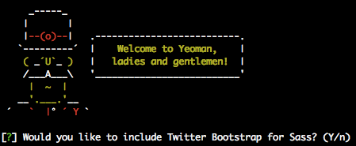
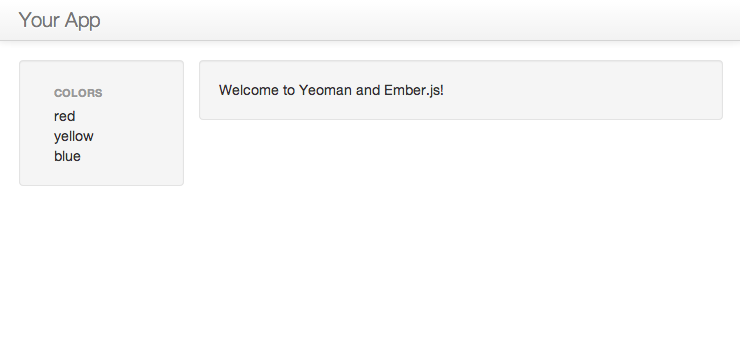
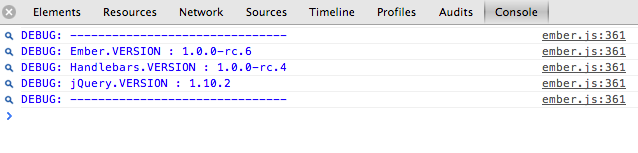

Recently there's been a lot of discussion around different JavaScript frameworks
such as Angular, Ember, Backbone with Marionette. After years of JS spaghetti
code and memory leaks, these frameworks solve many pain points previously felt
when building JavaScript applications. There are now great development tools
that help to quickly get started creating responsive, single page applications
with a maintainable codebase. Having rolled out a number of Backbone apps, I've
been interested to see how well Ember works in comparison. Here we're going to
spend a moment with <a href="http://emberjs.com/">ember.js</a> and
<a href="http://yeoman.io">Yeoman</a>.

Before we start, you must have <a href="http://nodejs.org">node</a> installed
and configured correctly. If not, install it and then come back.

## Yeoman

Yeoman is an intelligent collection of tools that make developing JavaScript
applications pain free (or at least less painful.) This is how we will be
quickly scaffolding our application, installing its dependencies and running a
development server to view the application.

In addition to the things we'll be covering here, Yeoman will build/minify your
app for production and run its test suite. See
<a href="http://yeoman.io">yeoman.io</a> for more information.

## Installing Yeoman

To install Yeoman and the generators for an Ember application, simply run:

```bash
npm install -g yo
npm install -g generator-ember
```

This will install the current version of Yeoman (rc1) and the Ember generators
(0.5.9). Great! Now we're ready to get going.

## Creating The Ember.js App

Create a new directory for the application and switch into it:

```bash
mkdir ember-demo
cd ember-demo
```

Running <code>yo ember</code> from the command line will give you a menu similar
to this:



Say yes to the following options:

* Would you like to include Twitter Bootstrap for Sass?

Following this, Yeoman will scaffold out an Ember app and automatically install
its required dependencies by running <code>bower install</code> and <code>npm
install</code>.

Once this is done, all you need to do is run

```bash
grunt server
```

This will open a web browser with your app which should look something like
this:



with the following info available in your browser's console:



So, great, we're now running a very simple Ember app. Wasn't that easy?

<h2>Troubleshooting</h2>

If you're having any trouble with this tutorial, make sure you have the latest
versions of Yeoman and generator-ember installed - it's simple to update them:
<code>npm update -g yo generator-ember</code>

<h2>The Results</h2>

This may look simple, but there are a few interesting things going on.

The page is generated dynamically by Ember - have a look in
<code>app/index.html</code> - you'll see that there's no markup, just a bunch of
required scripts. Here's where the magic is happening.

If you look in <code>app/templates</code>, you'll see
<code>application.hbs</code> and <code>index.hbs</code>. Two handlebar template
files that are telling Ember what to render. The three colours are coming from
data stored in <code>scripts/app.js</code>.

<h3>app.js</h3>

You can see that the colors printed on the index page are defined here in the
array. Add another item to the array, and the page will list that.

```javascript
App.IndexRoute = Ember.Route.extend({
  model: function() {
    return ["red", "yellow", "blue"];
  }
});
```

<h3>index.hbs</h3>

Here's the handlebar template that is used to render those items. Very simple,
but a good illustration of how you can use handlebars to loop through an array.

```html
<div class="hero-unit">
  <ul>
  {{#each item in model}}
    <li>{{item}}</li>
  {{/each}}
  </ul>
</div>
```

<h2>Conclusion</h2>

Using Yeoman, Bower, and Grunt is a great way to quickly scaffold the barebones
for a new JavaScript program. In less than 5 minutes, you can go from nothing,
to a basic framework to start building out your application.

<em>Updated July 16, 2013</em> updated instructions for generator-ember 0.5.2

<em>Updated July 19, 2013</em> updated instructions and screenshots for
generator-ember 0.5.7

<em>Updated July 27, 2013</em> generator-ember 0.5.9 and yeoman 1.0.0-rc.1.3
