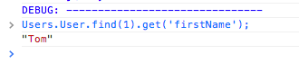
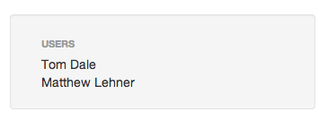
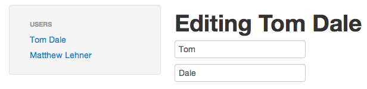

Last week we quickly scaffolding an Ember.js application using
<a href="http://yeoman.io">Yeoman</a>. That's great, but it's hardly useful to
have an app that displays a list. I can write HTML that does that just fine,
thanks very much. So, what's useful here? Why bother with a client side
framework at all? In this Ember.js tutorial, I want to do something that shows
off <strong>WHY</strong> you'd do this in Ember, rather than with Turbolinks and
a sprinkling of JavaScript. At the end of the tutorial, you'll understand enough
about Ember to do something useful with it.

As web developers, we all know that the internet is basically a series of text,
pictures, buttons and text fields that we put stuff into and look at. Our job is
to facilitate these types of interactions for our users; by making them quick
and pleasing we will leave the people using our products feeling satisfied. That
means that we must use JavaScript. The traditional approach is to augment static
pages, but using a client side framework like Ember or Angular allows this work
to happen quickly, while creating a maintainable code base. To demonstrate how
ember.js handles routing and rendering views, we're going to create a user
profile editor.

If you'd like to follow along, make a new directory called <code>users</code>
and initialize an ember.js app with yeoman in that directory. If you need more
information on how to do this,
<a href="/get-started-with-ember-js-in-5-minutes/">get started with Ember.js in
5 minutes</a> and then meet me back here.

With our initialization of the app, <code>Users</code> will be the global
namespace that everything happens in.

<h2>View Templates and {{outlet}}</h2>

We need to set up a space for our sidebar navigation, and a main area where our
logic will go. To do this, open up <code>app/templates/application.hbs</code>
and change it to look like this:

```xml
<div>
  <div class="container-fluid" id="main">
    {{outlet}}
  </div>
</div>
```

Don't worry, we'll be adding back the navigation logic in the next step, but
here its important to concentrate on <code>{{outlet}}</code> and what its
meaning is. The default hierarchy of template rendering works by first rendering
the overall application template which we've specified in
<code>application.hbs</code>; the call to <code>{{outlet}}</code> specifies
where the template that is specific to the current page will be rendered.

<h2>The default route - Index</h2>

Even if you haven't done anything in your application yet, Ember provides you
with a few basics without you even having to touch any code. By adding a
resource to the application's router, Ember will look for the associated route
logic, the controller and the view template. If it doesn't find the route logic
or the controller, Ember.js will automatically generate these for you. Out of
the box, without adding any code, visiting your root url goes through the
following actions:

<ul>
<li>The 'index' route name is visited, this passes the request to</li>
<li>The <code>IndexRoute</code> namespace route logic, which is auto generated if it's not present</li>
<li>The <code>IndexController</code>, (also auto generated) then handles the view template rendering of</li>
<li>A template with the associated name - in our case <code>index.hbs</code></li>
</ul>

This is an outline of the four most simple steps of a request in an Ember.js
application.

For this example, we want to set up our index template to render a list of users
in a navigation panel on the left. Edit <code>app/templates/index.hbs</code> to
look like this:

```xml
<div class="row-fluid">
  <div>
    <div class="span3">
      <div class="well sidebar-nav">
        <span class="nav-header">Users</span>
        <ul class="nav nav-list">
        </ul>
      </div>
    </div>
    <div class="span9">
      {{outlet}}
    </div>
  </div>
</div>
```

If you've scaffolded your application using Yeoman, then running <code>grunt
server</code> will show you a page that looks like this:

<figure>
  <%= image_tag "Yeoman_Ember_Starter_Kit-21-e1374854765505.png", alt: "Very
basic user navigation" %>
  <figcaption>Boring, but it's a start...</figcaption>
</figure>

Great, okay, so, we have a basic place where we could render a list of users to
click on and a nested <code>{{outlet}}</code> - this is where we'll render a
user profile.

<h2>Rendering Data</h2>

Adding data to Ember is simple using the
<a href="https://github.com/emberjs/data">ember-data</a> library. Right now, the
library is under HEAVY development, but for our purposes here, version 0.13 does
the trick nicely. We're going to add a User model and some user fixtures to
render since we're just demoing some front end features.

Our first step will be to add the user model.

```javascript
// app/scripts/models/user.js
Users.User = DS.Model.extend({
  firstName: DS.attr("string"),
  lastName: DS.attr("string"),
  administrator: DS.attr("boolean")
});
```

Fixtures are built in to Ember-data. To add them, we'll just configure our data
store.

```javascript
// app/scripts/store.js
Users.Store = DS.Store.extend({
  revision: 1,
  adapter: "DS.FixtureAdapter"
});
```

We'll also have to tell yeoman to load this file by adding the following to
<code>app/scripts/app.js</code>:

```javascript
require("scripts/store");
```

You might notice the revision attribute. This just represents the revision of
the API that you'll be communicating with, which, in our case is meaningless.
Right now this is required, but I'm assuming that with development, Ember-data
will just handle this automatically. Specifying <code>DS.FixtureAdapter</code>
just means that we can add user fixtures and Ember.js will treat them like
they've come from a web service. Let's do that. Add the these fixtures to the
bottom of <code>app/scripts/user.js</code>

```javascript
Users.User.FIXTURES = [
  {
    id: 1,
    firstName: "Tom",
    lastName: "Dale"
  },
  {
    id: 2,
    firstName: "Matthew",
    lastName: "Lehner"
  }
];
```

Great - we've got some users. If you'd like to test it out, just type
<code>Users.User.find(1).get('firstName')</code> into your browser console and
you can see that the response is this:



<h2>Rendering our data</h2>

So, here comes the good stuff. Finally we get to make a view render something
interesting, other than static HTML. How do we do this?

First, we have to find this data. The route for the specific view will specifies
which data is rendered in the template. To do this, we add the following logic
to <code>app/scripts/router.js</code>:

```javascript
Users.IndexRoute = Ember.Route.extend({
  model: function() {
    return Users.User.find();
  }
});
```

This tells your Ember.js app that the index route (remember, that's the default
route for the '/' url) is dealing with the data found in the `Users.User` model.
Now we'll tell the template in `app/templates/index.hbs` to render the users for
us. Add the following handlebars logic inside the `<ul class="nav nav-list">`
tag:

```xml
{{#each controller}}
  <li>{{firstName}} {{lastName}}</li>
{{/each}}
```

Refresh your page, and suddenly we're looking at a list of users!



<h2>Doing something useful - Adding a UI for editing.</h2>

So now that we've done a lot of work to create a list, lets do something useful
with it. We'll make the side bar into a navigation piece. Clicking on a user
will display a form for editing their profile. There are two steps to this, we
need to add a nested resource to the index route and tell the view template what
to render.

Add the following to <code>app/scripts/router.js</code>:

```javascript
Users.Router.map(function() {
  this.resource("index", { path: "/" }, function() {
    this.resource("user", { path: "/:user_id" });
  });
});

Users.UserRoute = Ember.Route.extend({
  model: function(params) {
    return Users.User.find(params.user_id);
  }
});
```

update the list items in <code>app/templates/index.hbs</code> to link to each
user resource:

```xml
<li>
  {{#linkTo 'user' this}}
    {{firstName}} {{lastName}}
  {{/linkTo}}
</li>
```

and the following view template to <code>app/templates/user.hbs</code>:

```xml
<header>
  <h1>Editing {{firstName}} {{lastName}}</h1>
</header>

<form>
  <fieldset>
    <div>{{view Ember.TextField valueBinding='firstName'}}</div>
    <div>{{view Ember.TextField valueBinding='lastName'}}</div>
  </fieldset>
</form>
```

And now we have editable users and thanks to Ember.js and Handlebars data
binding implementation, wherever an attribute is rendered on the page, it will
automatically change when edited. Try it out!



Since this Ember.js tutorial is about routing and rendering views, lets examine
what we've accomplished with this last step. You can see we've nested the
<code>user</code> resource under the <code>index</code> route; because it's
nested, this will automatically render to the <code>{{outlet}}</code> in our
index template.

<h3>Nested Views</h3>

Any web application that you'll be creating will have different requirements for
certain sections - perhaps a widget that gets rendered everywhere or a portion
that changes based on state. With Ember's handling of nested routes, you get
these page areas automatically. Remember how our <code>index.hbs</code> template
has another <code>{{outlet}}</code>? Well, that's where any resources that are
nested under the index action will be rendered. You can have nested routes for
anything that's associated with users such as activity, edit, show, profile,
friends, etc. and they will automatically render where you specify the outlet on
the main user template.

<h3>Data binding</h3>

Another benefit of Ember is that the data binding keeps all of the associated
attributes updated everywhere they've been rendered. There's no lag between
editing a user name, and that user's name showing up the way it's been changed.

This guide to Ember.js routing and rendering is really just touching on the
basics of routing and rendering within the framework. Each JavaScript MVC
framework has its own unique paradigm to how development should be done and I
find it helpful to start with a good foundation. From here, you can start
building out a more complicated application that consumes an API, has animated
elements and a user interface that responds instantly.
