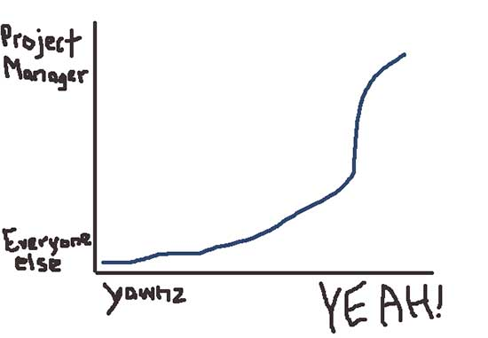

Go to <a href="http://www.reddit.com/r/freelance/">/r/freelance</a> on any day
of the week and invariably, there will be a post asking which project management
or time tracking software to use. The answers are always the same. There are two
types of results:

* big names like Basecamp, Asana, Trello, Harvest, and Freshbooks
* the little guys, which may or may not be the next big thing.

People have been building online project management software for over 10 years
now and we're still seeing the same iterations on a theme. The laundry list of
basic features never deviates - grab 5 or 6, a good designer and developer and a
few months later, you'll have built a project management app. Just combine to-do
lists, file uploads, and calendars with the people that are working together.
Some accomplish this with a side to side layout and calling the to-do lists
stories, some use a sheet layout with plain to-dos.

If you've worked on the internet, you've used this stuff and you probably know
what I'm talking about. If Basecamp is working for you, that's great and I'm not
writing for you right now.

Here's the underlying issue:

## Project management software assumes that you care about it

And not just you, but your client, and your employee, and that sub-contractor,
and your designer. You get the picture. And, by the way, the project management
software is probably wrong.

From behind the scenes, the software company that's making whatever solution
you're using spends a lot of time trying to get you to care. They think about it
a lot and they've probably designed a great onboarding process that gets you to
add things to the list and invite your team members. Getting you to care is
their job. It reduces the chances that you'll stop using their product and then
some day cancel your account. It increases your lifetime value, and reduces
their churn rate.

But we just don't care. I've been invited to Basecamp almost 10 times, Asana a
handful, and Pivotal Tracker. Each time, I have to learn some new way of flowing
through a project.

I get that this is necessary; I manage projects. I need a tool to keep things
organized and help me keep track of where things are at. If I don't use
something, I fail. I've failed really badly with a few projects because I didn't
use project management software, so I understand the WHY behind this stuff.

So, we've established that currently, project management software is probably
most useful to the project manager. For everyone else, it's usefulness lies
somewhere lower down along a graph that displays "REALLY USEFUL, CAN'T WAIT TO
LOG IN" to "stop wasting my time, stupid website."

### Most people don't care about the project management software

The underlying assumption that all of these tools are built on is that there are
two types of people: people who really want to get stuff done, and people who
really want those other folks to keep getting stuff done.

Obviously your client wants you to get stuff done. That's why they hired you,
and that's why you added all of those things into the website so that someone
else could check them off. Your designer and developer probably don't care that
much about getting the same stuff done that you or your client care about.
They've got other needs; they want to refactor that user model the last guy
wrote because it kind of smells. They'll do the things on the list, but only
because at the end of the day/week/whatever review period, they know they're
going to have to give you a reasonable answer as to what it is that they have
been doing for the money that you're paying them.

Your client doesn't care about your project management software. If they do,
well, that's weird because it's not what they're paying you for; in fact, their
caring will likely cause you more problems. But basically, they just want to get
some kind of progress report and be kept in the loop whenever you're making an
important decision - like whether or not their logo should be the same 'cool'
colour green that Nike running shoes seem to be all about these days, or if you
just want to write 'buttz' in 72px font on their home page.

## Project management software should care about you and everyone else too

So, I've established that project management software isn't doing a great job,
but I think it could. Here's what I would love to see.

### Send me really nice emails

I want the status reports to feel like a warm hug, because things are getting
done. The software should be able to send really nice looking progress reports
to the project manager and the client. If anyone else cares, they should be able
to opt in.

I'm assuming that this is something that's probably happening more often these
days, but I remember getting a lot of janky, almost plain text emails with a
bunch of individual to-do list items marked off. This doesn't help me see the
overarching picture, or how we're progressing.

### Don't make me leave my inbox!

If we're sending an email to someone, don't make them leave the inbox and then
send them to a login screen. If the email requires a response, you should be
able to reply directly or just click a link in the email to submit a response.

### Just stop making me log in.

When the client, a worker, or I get an email that doesn't require a response,
there should be a link that lets you view the project right from there! Like a
forgotten password link. It's not hard. For security, if they want to edit or
change something, THEN ask for the password. Most people are not super tech
stars and don't have 1Password or LastPass installed. Just remove this barrier.

### Remind me if I'm supposed to do something and I haven't done it

But please do it nicely. A simple - "Hey! You've got these things assigned to
you but haven't done anything with them for a while. Is something blocking you?"
would do nicely. Right now, I send these emails, but I shouldn't have to. Don't
be irritating with them, just send them if something is overdue by a day or two
and nothing has been happening.

I work a lot with subcontractors which is great, but it's not great, because
they all have different schedules and varying commitment to the project
management software we're using for the project. Since it's called project
management software, I want it to actually manage the project, not just be a
clicky to-do list timetracker.

### Keep track of time for me

This might be a pipe dream, but shouldn't there be a way to watch github
commits, or file updates in dropbox (for designers saving in Photoshop). This
one is probably the hardest thing to track as entire pieces of software are
devoted solely to this cause, but just make a good effort.

## Is this too much to ask?

To me, this seems like the bare minimum for a project management application,
but it feels like such a stretch to get to this point and I'm not sure why.
Keeping track of remote collaboration and asynchronous communication shouldn't
be so hard.
